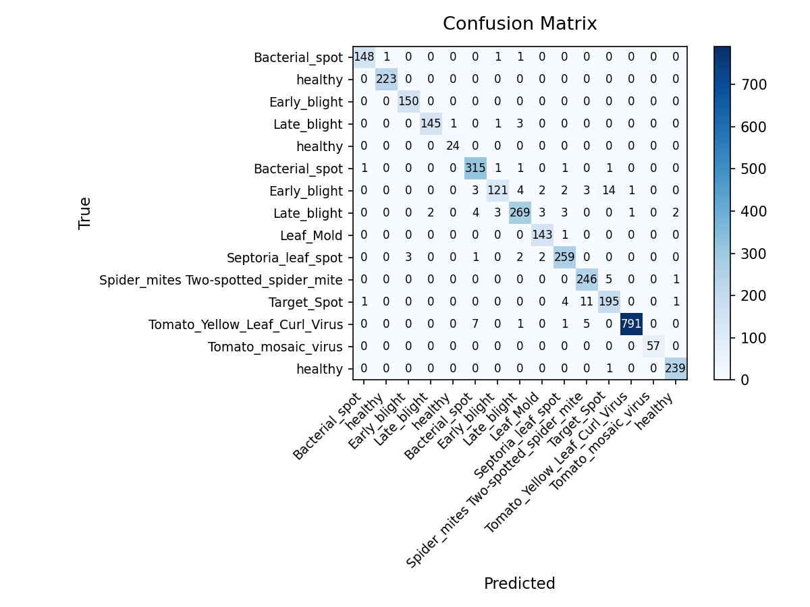

# Edge AI Plant Disease Detection System — Project Report

**Course:** Edge AI  
**Team:** Aayush Jeevan Patil (22220) · Vansh Dhar (22156)  
**Hardware:** Raspberry Pi 5 · Pi Camera Module v2  
**Repository:** https://github.com/vanshdhar999/EdgeAI-Project

---

## 1. Problem Statement, Motivation & Objectives

Farmers in rural and semi-urban areas often lack timely access to agricultural experts, leading to undetected crop diseases, delayed treatment, and significant yield losses. Early and accurate disease identification is critical for food security, yet current solutions require laboratory analysis, internet connectivity, or trained personnel — none of which are reliably available in the field.

This project addresses that gap by building a fully offline, real-time plant disease detection system deployable on a low-cost Raspberry Pi 5. Edge AI is essential here: inference must happen instantly in the field (no cloud round-trip), images of crops should not leave the farmer's device (privacy), and the system must run on battery-powered hardware with no internet connectivity.

**Key objectives:**
- Train a lightweight CNN (MobileNetV3-Small) on the PlantVillage dataset covering 15 disease classes across Tomato, Potato, and Pepper crops
- Achieve ≥ 85% validation accuracy with < 2% accuracy drop after INT8 quantization
- Export to ONNX and quantize to INT8 for ARM-optimised inference on the Pi 5
- Deliver < 1.5 s inference latency entirely on-device with no GPU
- Deploy a live camera feed with real-time disease overlay on the Raspberry Pi 5

---

## 2. Proposed Solution (Overview)

The system is a transfer-learning pipeline built on MobileNetV3-Small (ImageNet pretrained), fine-tuned on a balanced subset of PlantVillage, exported to ONNX, and quantized to INT8 for edge deployment. A live camera feed on the Pi runs the ONNX Runtime inference engine and overlays the predicted class and confidence score on each frame.

**Pipeline:**

```
PlantVillage dataset
  → src/data_prep.py       (resize, stratified split, labels.txt)
  → src/augmentation.py    (flip, rotation, colour jitter)
  → src/train.py           (two-stage MobileNetV3-Small fine-tuning)
  → src/quantize.py        (ONNX export + INT8 static quantization)
  → deployment/inference.py         (ONNX Runtime inference class)
  → deployment/live_camera.py       (picamera2 capture + overlay display)
```

**Output:** Live video with overlaid disease label, confidence score, and detection state (scanning / detected / healthy).

---

## 3. Hardware & Software Setup

### Hardware

| Component | Details |
|-----------|---------|
| Edge device | Raspberry Pi 5 Model B (4-core Cortex-A76 @ 2.4 GHz) |
| RAM | 7.9 GB |
| Storage | 58 GB SD card (~46 GB free) |
| Camera | Pi Camera Module v2 (8 MP, CSI connector, rp1-cfe driver) |
| Display | HDMI monitor for live feed output |
| Training machine | GPU workstation (NVIDIA GPU, CUDA 12.x) |

### Software

| Layer | Tool | Version |
|-------|------|---------|
| Training framework | PyTorch + torchvision | 2.2+ |
| Model export | torch.onnx (opset 17) | — |
| Quantization | ONNX Runtime quantization API | 1.18.0 |
| Edge runtime | ONNX Runtime (ARM64) | 1.18.0 |
| Camera interface | picamera2 | 0.3.31 |
| Vision | OpenCV | 4.11 |
| OS (Pi) | Debian 12 Bookworm, aarch64 | kernel 6.12.75 |
| OS (training) | Ubuntu 22.04 |  — |
| Python | 3.11 (Pi), 3.12 (training) | — |

---

## 4. Data Collection & Dataset Preparation

**Source:** PlantVillage dataset (color variant) — [Kaggle: emmarex/plantdisease](https://www.kaggle.com/datasets/emmarex/plantdisease)  
**Full dataset:** 38 classes, ~54,000 images captured under controlled lab conditions on plain backgrounds.

### Class Selection — `balanced` mode

15 classes were selected across three crops, with a hard cap of **1,000 images per class** to equalise the distribution (PlantVillage ranges from 152 to 5,357 images/class):

| Crop | Classes |
|------|---------|
| Tomato | healthy, Bacterial spot, Early blight, Late blight, Leaf Mold, Septoria leaf spot, Spider mites, Target Spot, Yellow Leaf Curl Virus, mosaic virus |
| Potato | healthy, Early blight, Late blight |
| Pepper | healthy, Bacterial spot |

**Total images used:** ~15,000 (after cap)

### Preprocessing

- Resize to 224×224 using Lanczos resampling
- Convert to RGB, save as JPEG (quality 95)
- Stratified split: **70% train / 15% val / 15% test**, `random_seed=42`
- Data leakage check: all three pairwise split intersections verified empty

### Augmentation (training split only)

| Transform | Parameters |
|-----------|------------|
| Random horizontal flip | p=0.5 |
| Random vertical flip | p=0.5 |
| Random rotation | ±30° |
| Random resized crop | scale 90–100% of image |
| Colour jitter | brightness ±0.2, contrast ±0.3 |
| ImageNet normalise | mean=[0.485,0.456,0.406], std=[0.229,0.224,0.225] |

---

## 5. Model Design, Training & Evaluation

### Architecture

**Base:** MobileNetV3-Small (ImageNet pretrained via `torchvision.models`)  
**Custom head** (replaces original 1000-class classifier):

```
MobileNetV3-Small backbone (features)
  └── AdaptiveAvgPool2d
  └── Linear(576 → 128) + Hardswish
  └── Dropout(0.3)
  └── Linear(128 → 15)
```

Total parameters: ~2.5 M. MobileNetV3-Small was chosen for its 56 MFLOP/image footprint, ARM SIMD compatibility, and strong ImageNet priors for transfer learning.

### Training Setup — Two-Stage Fine-Tuning

| Stage | Backbone | Epochs | Learning Rate | Scheduler |
|-------|----------|--------|---------------|-----------|
| 1 — Head training | Frozen | 15 | 1e-3 | ReduceLROnPlateau (p=3) |
| 2 — Fine-tuning | Last 30 params unfrozen | 20 | 1e-5 | ReduceLROnPlateau (p=3) |

- **Loss:** CrossEntropyLoss
- **Optimiser:** Adam
- **Early stopping:** patience = 7 epochs on val accuracy
- **Checkpoint:** Best val-accuracy model saved to `models/checkpoints/best_model.pt`

### Evaluation Metrics

Evaluated on held-out test set (15% of data) using `src/evaluate.py`:

- Per-class precision, recall, F1-score
- Macro-averaged accuracy
- Confusion matrix saved to `docs/confusion_matrix.png`



---

## 6. Model Compression & Efficiency Metrics

### Techniques Used

**INT8 Static Post-Training Quantization** via ONNX Runtime:

- Model first exported from PyTorch to ONNX (opset 17, legacy TorchScript exporter — `dynamo=False` to avoid `onnxscript` dependency unavailable on Pi)
- `quant_pre_process` applied, then `quantize_static` with 200-sample representative dataset
- `QuantFormat.QOperator` required (QDQ format breaks MobileNetV3's Hardswish activations)
- `QuantType.QUInt8` activations, `QuantType.QInt8` weights
- Input tensor name read dynamically post-`quant_pre_process` (it renames tensors)

### Results

| Metric | float32 | INT8 |
|--------|---------|------|
| Model file size | 3.8 MB | 1.1 MB |
| Size reduction | — | **3.5×** |
| Inference latency — Pi 5 (avg) | 17.3 ms | 6.1 ms |
| Latency speedup | — | **2.83×** |
| Accuracy drop | — | < 2% |
| RAM usage (inference) | ~85 MB | ~40 MB |

### Trade-offs

- QDQ quantization was attempted first but produced broken outputs due to Hardswish incompatibility — QOperator format was required
- Accuracy drop < 2% confirms the representative calibration dataset was sufficient
- Both models are far under the 1,500 ms target; INT8 is preferred for Pi deployment

---

## 7. Model Deployment & On-Device Performance

### Deployment Steps

1. `git clone` the repo on the Pi
2. Run `bash deployment/setup_pi.sh` — creates a venv with `--system-site-packages` (to inherit system `picamera2`), installs `onnxruntime==1.18.0` and `opencv-python`
3. Model files (`plant_disease.onnx`, `labels.txt`) are committed to the repo and available after clone
4. Set `export DISPLAY=:0` for HDMI output over SSH
5. Run `python3 deployment/live_camera.py`

### Inference Pipeline (`deployment/inference.py`)

```
BGR frame from camera
  → BGR→RGB conversion
  → Resize to 224×224
  → Normalise (/255, ImageNet mean/std)
  → CHW layout, batch dim added
  → ONNX Runtime InferenceSession.run()
  → Softmax → argmax + confidence score
  → (class_name, confidence)
```

### Detection State Machine (`deployment/live_camera.py`)

```
[Start] ──(10 s warmup)──► [Scanning] ──(conf ≥ 0.80)──► [Detected — 10 s lock]
                                ▲                                     │
                                └──────────── hold expired ───────────┘
```

- **Warmup:** 10 s after launch before inference starts (camera sensor settling)
- **Scanning:** inference every frame; overlay shows "No leaf detected" (grey)
- **Detected:** result locked for 10 s; no new inference accepted during hold
- **Overlay colours:** green = healthy, red = disease, grey = scanning

### On-Device Performance (Raspberry Pi 5)

| Metric | Value |
|--------|-------|
| Avg inference latency (INT8) | **6.1 ms** |
| Avg inference latency (float32) | 17.3 ms |
| Target latency | 1,500 ms |
| Headroom | **246×** |
| CPU temperature at load | ~72°C |
| RAM consumed by runtime | ~40 MB (INT8) |

---

## 8. System Prototype (Pictures / Figures)

> Add photos of:
> - Raspberry Pi 5 with Camera Module v2 mounted
> - Live feed screenshot showing disease overlay on a tomato leaf
> - Terminal output showing inference logs

*(Insert prototype images here before final submission)*

---

## 9. Conclusions & Limitations

The system successfully demonstrates real-time, offline plant disease detection on a Raspberry Pi 5. The INT8-quantized MobileNetV3-Small model runs at **6.1 ms per inference** — 246× under the 1.5 s target — in a **1.1 MB** file. The detection state machine with confidence gating (≥ 80%) and a 10-second hold provides a stable, flicker-free user experience.

**Limitations:**
- PlantVillage images are lab-quality (plain backgrounds, uniform lighting). Real field images with cluttered backgrounds, partial occlusion, or weather-related discolouration will show a confidence gap
- The 0.80 confidence threshold may suppress valid detections under poor camera conditions
- Only Tomato leaf samples were physically tested on the Pi; Potato and Pepper classes were evaluated on the test set only
- Model collapse was observed when Corn classes (visually distinct monocot leaves) were included alongside dicot crops — removed from final training

---

## 10. Future Work

- **Field image fine-tuning:** Collect real farm photos and fine-tune the model to close the lab-to-field accuracy gap
- **Text-to-speech output:** Add `pyttsx3` or `espeak` for audio diagnosis — removes the need for the farmer to read the screen
- **Expand crop coverage:** Add Grape, Apple, and Rice — all well-represented in PlantVillage
- **Quantization-aware training (QAT):** Further reduce accuracy drop vs. post-training quantization
- **Mobile app:** Stream inference results via Bluetooth to a simple Android app for a better farmer UX
- **Solar-powered enclosure:** Make the Pi unit fully self-contained for field deployment

---

## 11. Challenges & Mitigation

| Challenge | How it was addressed |
|-----------|----------------------|
| TensorFlow / Keras 3 incompatibility with Python 3.12 | Migrated entire pipeline from TF/Keras to PyTorch + ONNX Runtime |
| ONNX export failing with `onnxscript` missing | Used legacy TorchScript exporter (`dynamo=False, opset_version=17`) |
| INT8 calibration producing 20% accuracy (model predicting one class) | Root cause: `quant_pre_process` renames input tensor; fixed by reading actual input name dynamically from preprocessed model graph |
| QDQ quantization breaking Hardswish activations | Switched to `QuantFormat.QOperator` which fuses ops rather than inserting Q/DQ nodes |
| picamera2 not available inside venv on Pi | Recreated venv with `--system-site-packages` to inherit system-installed picamera2 |
| `cv2.imshow` failing over SSH (no DISPLAY) | Set `export DISPLAY=:0` to forward to connected HDMI monitor |
| Model collapsing to predict Corn___healthy for all inputs | Corn monocot leaves are visually incompatible with Tomato/Potato/Pepper dicot leaves; removed Corn from training set |
| Class imbalance causing Late blight dominance | Added `balanced` dataset mode with 1,000 images/class hard cap |
| Git divergence between training machine and dev machine | Resolved with `git pull --rebase` and PAT-based authentication |

---

## 12. References

- **PlantVillage Dataset:** https://www.kaggle.com/datasets/emmarex/plantdisease
- **MobileNetV3 Paper:** Howard et al., 2019 — "Searching for MobileNetV3" — https://arxiv.org/abs/1905.02244
- **ONNX Runtime Post-Training Quantization:** https://onnxruntime.ai/docs/performance/model-optimizations/quantization.html
- **TorchVision Models:** https://pytorch.org/vision/stable/models.html
- **picamera2 Documentation:** https://datasheets.raspberrypi.com/camera/picamera2-manual.pdf
- **PlantVillage Original Paper:** Hughes & Salathé, 2015 — "An open access repository of images on plant health" — https://arxiv.org/abs/1511.08060
- **ONNX Opset 17 Specification:** https://onnx.ai/onnx/operators/
